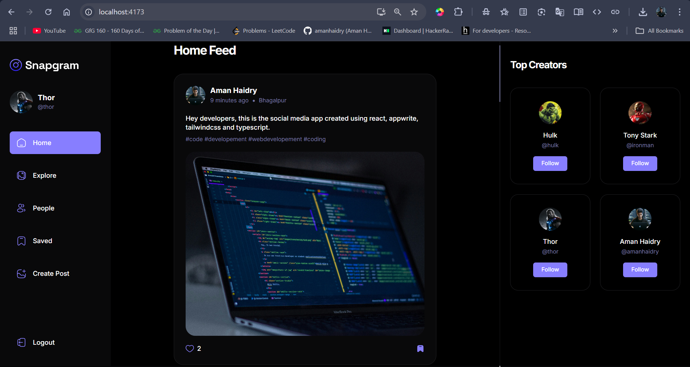

<p align="center">
  
</p>

## 📋 <a name="table">Table of Contents</a>

1. 🤖 [Introduction](#introduction)
2. ⚙️ [Tech Stack](#tech-stack)
3. 🔋 [Features](#features)
4. 🤸 [Quick Start](#quick-start)


## <a name="introduction">🤖 Introduction</a>

Snapgram is a modern social media platform that lets you create, update, like, and save posts, as well as update your profile and search for content. Enjoy features like infinite scrolling and seamless post discovery. Built with React, Tailwind CSS, TypeScript, Appwrite, and more, Snapgram delivers a fast, responsive, and engaging user experience.


## 🚀 Live Demo

Check out the deployed project here: [Snapgram Live](https://snapgram-socialmedia.netlify.app/)


## <a name="tech-stack">⚙️ Tech Stack</a>

- **React.js**: For building fast, interactive user interfaces using a component-based architecture.
- **Appwrite**: Backend as a Service (BaaS) providing authentication, database, storage, and more.
- **React Query**: Handles data fetching, caching, and synchronization for seamless UI updates.
- **TypeScript**: Adds static type safety to JavaScript, reducing bugs and improving code maintainability.
- **Shadcn**: Supplies modern, accessible UI components for rapid development.
- **Tailwind CSS**: Utility-first CSS framework for creating responsive and customizable designs efficiently.


## <a name="features">🔋 Features</a>

👉 **Authentication System**: A robust authentication system ensuring security and user privacy

👉 **Explore Page**: Homepage for users to explore posts, with a featured section for top creators

👉 **Like and Save Functionality**: Enable users to like and save posts, with dedicated pages for managing liked and saved content

👉 **Detailed Post Page**: A detailed post page displaying content and related posts for an immersive user experience

👉 **Profile Page**: A user profile page showcasing liked posts and providing options to edit the profile

👉 **Browse Other Users**: Allow users to browse and explore other users' profiles and posts

👉 **Create Post Page**: Implement a user-friendly create post page with effortless file management, storage, and drag-drop feature

👉 **Edit Post Functionality**: Provide users with the ability to edit the content of their posts at any time

👉 **Responsive UI with Bottom Bar**: A responsive UI with a bottom bar, enhancing the mobile app feel for seamless navigation

👉 **React Query Integration**: Incorporate the React Query (Tanstack Query) data fetching library for, Auto caching to enhance performance, Parallel queries for efficient data retrieval, First-class Mutations, etc

👉 **Backend as a Service (BaaS) - Appwrite**: Utilize Appwrite as a Backend as a Service solution for streamlined backend development, offering features like authentication, database, file storage, and more


👉 **Progressive Web App (PWA) Support**: Install Snapgram as an app on your mobile device or desktop for a native-like experience, including offline capabilities and home screen access


and many more, including code architecture and reusability 


## <a name="quick-start">🤸 Quick Start</a>

Follow these steps to set up the project locally on your machine.

**Prerequisites**

Make sure you have the following installed on your machine:

- [Git](https://git-scm.com/)
- [Node.js](https://nodejs.org/en)
- [npm](https://www.npmjs.com/) (Node Package Manager)

**Cloning the Repository**

```bash
git clone https://github.com/amanhaidry/Snapgram.git
cd Snapgram
```

**Installation**

Install the project dependencies using npm:

```bash
npm install
```

**Set Up Environment Variables**

Create a new file named `.env` in the root of your project and add the following content:

```env
VITE_APPWRITE_URL=
VITE_APPWRITE_PROJECT_ID=
VITE_APPWRITE_DATABASE_ID=
VITE_APPWRITE_STORAGE_ID=
VITE_APPWRITE_USER_COLLECTION_ID=
VITE_APPWRITE_POST_COLLECTION_ID=
VITE_APPWRITE_SAVES_COLLECTION_ID=
```

Replace the placeholder values with your actual Appwrite credentials. You can obtain these credentials by signing up on the [Appwrite website](https://appwrite.io/).

**Running the Project**

```bash
npm run dev
```

Open [http://localhost:5173](http://localhost:5173) in your browser to view the project.

---

Happy coding! 🚀